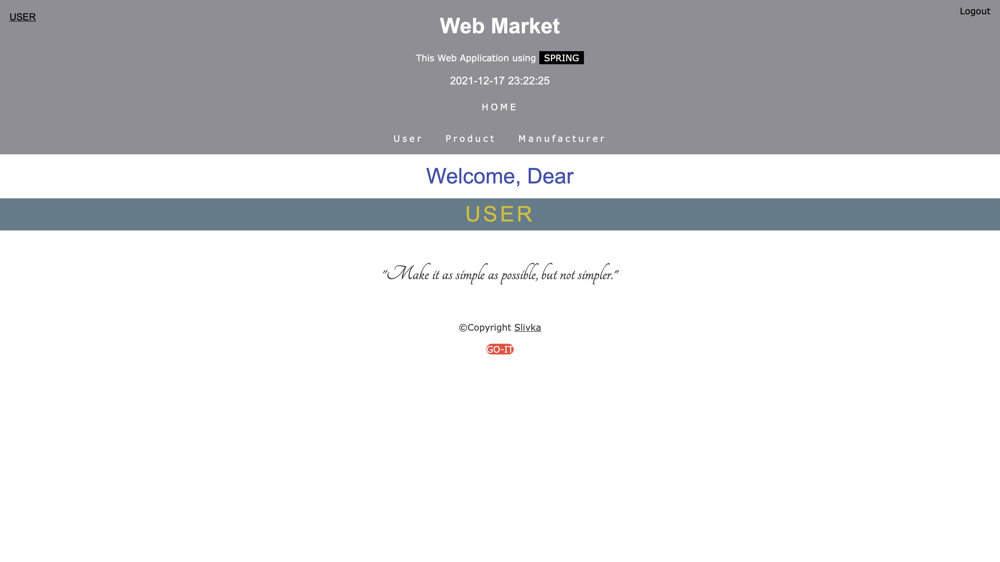

[SpringWebMarket](https://spring-webmarket.herokuapp.com)

[//]: # ([]&#40;WebMarket.png&#41;)

# Spring Market Application

ADD to Application.properties:

- DB_USERNAME = {YOUR_DB}

- DB_PASSWORD = {YOUR_PASSWORD}

- DB_URL = {YOUR_DB_URL}
#For example:

* DB_USERNAME = root

* DB_PASSWORD = super_password

* DB_URL = jdbc:postgresql://localhost:5432/MYSQL_DB

[comment]: <README.md> (before the start of application you have to add environment variables:)

[comment]: </README.md> (  DB_USERNAME - prod)

[comment]: </README.md> (  DB_PASSWORD - password of user)

[comment]: </README.md> (  DB_URL - database URL)

[comment]: </README.md> (for example:)

[comment]: </README.md> (  export DB_USERNAME=prod)

[comment]: </README.md> (  export DB_PASSWORD=super_password)

[comment]: </README.md> (  export DB_URL=jdbc:postgresql://localhost:5432/postgres)

#Coming soon

- notes
- weather
- translator(eng-ukr/ukr-eng)
...
